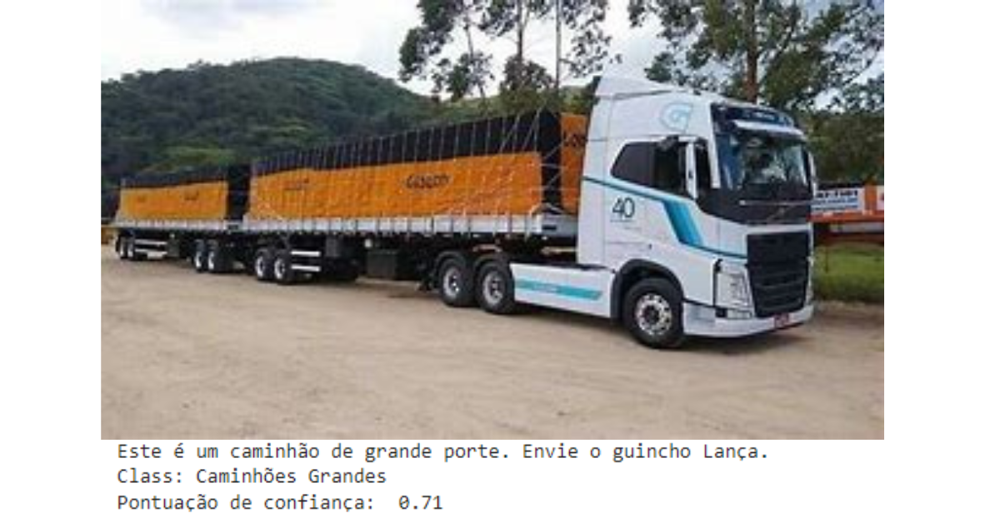

# PROJETO CHALLENGE 2023

Utilizamos a Inteligência Artificial para direcionar o guincho ideal para cada caminhão, tornando nossos serviços mais eficientes e rápidos!

## Índice
- <a href="#funcionalidades do projeto">Funcionalidades do Projeto</a>
- <a href="#contato">Contato com o cliente</a>
- <a href="#requisitos">Requisitos</a>
- <a href="#demonstracao">Demonstração</a>
- <a href="#passos">Detalhes do Projeto</a>
- <a href="#tecnologia">Tecnologias Utilizadas</a>

## Funcionalidades do Projeto

 - [x] Recebimento de imagens.
 - [x] Análises de dados.
 - [x] Tomada de decisões baseadas em Inteligência Artificial.
 - [x] Envio de modal correto.

 ## Contato com o cliente
 

 ## Requisitos
 - [x] Banco de dados.
 - [x] Integração do software no WhatsApp.
 - [x] Garantir que o cliente possui cadastro na Porto.
 - [x] Sistema de reconhecimento de imagens veiculares para identificar as necessidades de resgate de forma precisa, permitindo assim a escolha do guincho mais apropriado para o atendimento.

## Demonstração
-  Os dados usados no treinamento da IA consistem em imagens coletadas do Google e foram categorizados com base em fontes especializadas caminhões, dividindo-os em diferentes categorias:

	*  Caminhões Leves
	*  Caminhões Pesados
	*  Caminhões Danificados

 
 
 

-  O programa retorna a previsão de qual categoria a imagem fornecida pertence, caso seja uma taxa maior que 70%, a previsão é dada como verdadeira. Além disso, a taxa de confiança da resposta do algoritmo também é apresentada. Em conformidade com os dois fatores exibidos, é informado juntamente o tipo de guincho que se deve utilizar na operação.

## Detalhes do Projeto
-  A entrega do Sprint 4 consiste em um projeto que visa fornecer respostas precisas e confiáveis com o apoio da Inteligência Artificial, a fim de otimizar o tempo e reduzir a necessidade do atendimento humano. Este projeto tem como objetivo principal auxiliar na escolha dos guichos corretos para cada caminhão resgatado, tornando o processo de resgate de caminhões mais eficiente e organizado.

-  Através da implementação de algoritmos e técnicas de Inteligência Artificial, a solução irá analisar uma série de fatores, como o tipo de caminhão, as condições de tráfego, a localização do incidente e outras variáveis relevantes. Com base nessas informações, a IA irá recomendar automaticamente o guichê mais apropriado para o atendimento, levando em consideração a capacidade de cada guichê, a disponibilidade dos recursos, e a urgência do resgate.

-  Essa abordagem tem o potencial de otimizar o tempo gasto no processo de atendimento a caminhões resgatados, minimizando atrasos e alocando recursos de forma mais eficaz. Além disso, ao reduzir a necessidade de intervenção humana na tomada de decisões sobre a alocação de guichês, a solução também pode reduzir erros humanos e aumentar a consistência das respostas, tornando o serviço mais confiável.

-  Em resumo, o projeto do Sprint 4 visa melhorar a eficiência e a confiabilidade do processo de atendimento a caminhões resgatados, utilizando a Inteligência Artificial para determinar os guichês mais apropriados com base em dados e critérios pré-definidos. Isso resultará em um serviço mais rápido e eficaz, economizando tempo e recursos.

## Tecnologias Utilizadas

-  Utilizamos a ferramenta Teachable Machine para o reconhecimento das imagens, integrado com o Jupiter Notebook para a utilização e construção do algoritmo. Com essas ferramentas conseguimos obter resultados que indicam qual é o melhor guincho a ser usado em cada caso, apenas fornecendo uma imagem do veículo que precisa ser atendido.
-  Para as categorias de caminhões leves ou danificados, deve-se enviar o guincho Plataforma, e nos casos de caminhões médios ou pesados, o algoritmo deve enviar o guincho Lança.
